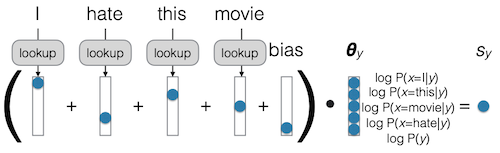

# 2 Text Classification

> [CMU Advanced NLP 2022 (2): Text Classification](https://youtu.be/boPpVexvDAI)

---

## 2.1 General Framework for NLP Systems

대표적인 NLP task를 입출력 기준으로 분류하면 다음과 같다.

| 입력 $X$ | 출력 $Y$ | Task |
| :---: | :---: | :---: |
| Text | Text in Other Language | Translation |
| Text | Response | Dialog |
| Text | Label | Text Classification |
| Text | Linguistic Structure | Language Analysis |

---

### 2.1.1 Generative, Discriminative Modeling

> [Google Developers: What is a Generative Model?](https://developers.google.com/machine-learning/gan/generative)

**Generative**, **Discriminative** modeling을 통해 Text Classification을 수행하는 방법을 알아볼 것이다. 먼저 Generative Model과 Discriminative Model의 차이를 알아보자.

| Generative Model | Discriminative Model |
| :---: | :---: |
|  |  |
| 입력 샘플 $X$ 를 생성한다. | 입력 $X$ 가 label $Y$ 일 확률을 반환한다. |
| stand alone: $P(X)$ <br/> joint(label 존재): $P(X,Y)$ | conditional: $P(Y\|X)$ |

이를 text classification에 적용하면 다음과 같다.

- Generative Text Classifciation

```math
\hat{y} = \mathrm{arg} \underset{\tilde{y}}{\max} P(X, \tilde{y})
```

- Discriminative Text Classification

```math
\hat{y} = \mathrm{arg}\underset{\tilde{y}}{\max}P(\tilde{y} , X)
``` 

---

## 2.2 Generative Text Classification

먼저 다음 단어의 확률을 계산하는 language modeling은, 다음과 같이 나타낼 수 있다.

> modeling 목표는 sentence, document, book 등, 어떠한 길이를 갖는 대상이든 다양할 수 있다.

```math
P(X) = \prod_{i=1}^{I}P( \underset{next \ word}{x_i} \ |  \ \underset{context}{x_1, \cdots, x_{i-1}})
```

관건은, 어떻게 $P(X)$ 를 계산할 것인가이다. 

---

### 2.2.1 Simplest Language Model: Count-based Unigram Models

먼저 다음과 같은 가정을 통해, 매우 간단한 language model을 설계할 수 있다.

- **Independence assumption**

  다음 단어의 확률은, 이전 단어들의 확률과 무관하다고 가정한다.

$$ P(x_i | x_1, \cdots , x_{i-1}) \approx P(x_i) $$

- **count-based maximum-likelihood estimation**

  다음 단어의 확률은, 특정 단어가 나오는 빈도수(count)를 센 뒤, corpus의 전체 단어 수로 나누어 계산한다.

$$ P_{MLE}(x_i) = {{c_{train}(x_i)} \over {\sum_{\tilde{x}}c_{train}(\tilde{x})}} $$

하지만 간단한 만큼 가지고 있는 문제점도 많다.

- (-) 학습 데이터에 없는 unknown word(**unk**)는, 확률로 0을 갖게 된다.

- (-) 모든 단어에 대해, distribution을 계산해야 한다.

  - character/subword-based model

    spelling에 기반하여 단어의 확률을 계산한다.

  - uniform distribution

    충분한, '고정'된 크기를 갖는 vocabulary( $N_{vocab}$ )를 기반으로, 모든 단어의 확률을 계산한다.

참고로 unknown word 문제는, ${\lambda}_{unk}$ 계수를 추가하여, 두 가지 확률로 구성된 식으로 구성하여 보완할 수 있다.

```math
P(x_i) = (1-{\lambda}_{unk}) * P_{MLE}(x_i) + {\lambda}_{unk} * P_{unk}(x_i)
```

---

### 2.2.2 Parameterizing in Log Space

확률의 곱은, 로그 확률의 덧셈으로 표현할 수 있다. 이러한 표현은 계산에서 안정성과 다양한 편의성을 제공한다.

$$ P(X) = \prod_{i=1}^{|X|}P(x_i) \rightarrow \log{P(X)} = \prod_{i=1}^{|X|} \log{P(x_i)} $$

특정 단어에 대한 로그 확률은 다음과 같이 표현할 것이다.

$$ {\theta}_{x_i}  := \log{P(x_i)} $$

---

### 2.2.3 Generative Text Classifier

generative text classifier의 joint probability는, 다음과 같이 조건부 확률 기반으로 표현할 수 있다.

$$ P(X, y)  = P(X|y) P(y) $$

이를 통해 확률을 class-conditional language model의 관점에서 해석할 수 있고, 각 항은 다음과 같은 의미를 갖는다.

- $P(X|y)$

  입력이 해당 클래스와 얼마나 일치하는지를 나타낸다.

- $P(y)$ 

  class prior probability (**bias**)

$$ P(y) = {{c(y)} \over {\sum_{\tilde{y}}c(\tilde{y})}} $$

---

### 2.2.4 Bag-of-Words Generative Classifier (BoW)

다음은 **Naive Bayes**로 종종 지칭되는, bag-of-words generative classifier의 예시이다.



- ${\theta}_y$ : parameter vector

  입력마다 각 클래스에 해당될 확률을 출력한다.

- $S_y$ : score

---

## 2.3 Discriminative Text Classification

discriminative model를 사용함에 있어서, 입력을 modeling하는 데 그만큼 많은 capacity가 필요하다는 점에 유의해야 한다.

- 출력 확률을 direct하게 modeling하기 때문에, 뛰어난 성능을 가져야 한다.

- 그러나, 필요한 모든 주제를 포괄하기 위해서는, 매우 긴 학습 시간 및 자원이 필요하다.

특히, (generative model과 달리) discriminative model은 간단한 **count-based decomposion**으로 표현할 수 없다. 

---

### 2.3.1 Discriminative Model Training

이러한 문제점 때문에, parameters $\theta$ 에 기반하여, 확률을 직접적으로 계산하는 방식으로, discriminative model을 정의한다.

$$ P(y|X; \theta) $$

- training loss function

  모델 성능이 좋을수록 작은 값을 가져야 하기 때문에, **negative log-likelihood**를 사용한다.

```math
{\mathcal{L}}_{train} (\theta) = - \sum_{<X,y> \in D_{train}} \log {P(y| X; \theta)}
```

- optimization

```math
\hat{\theta} = \mathrm{arg} \underset{\hat{\theta}}{\min} {\mathcal{L}}_{train}(\tilde{\theta})
```

---

### 2.3.2 BOW Discriminative Model

먼저, positive/negative의 간단한 이진 분류(binary classification) 문제에서, BOW discriminative model을 설계해보자.

- score

```math
s_{y|X} = {\theta}_y + \sum_{i=1}^{|X|}{\theta}_{y|x_i}
```

- score to probability (e.g. using sigmoid)

```math
P(y|X;\theta) = \mathrm{sigmoid}(s_{y|X} = {{1} \over {1 + e^{-s_{y|X}}}})
```

multi-class decision에서는, **softmax**를 사용하여 확률을 계산한다.

```math
P(y|X;\theta) = {{e^{s_y|X}} \over {\sum_{\tilde{y}}e^{s_{\tilde{y}{|X}}}}}
```

---

## 2.4 Evaluation

generative, discriminative model을 모두 설계했을 때, 어떤 것이 더 좋은 모델인지를 판단할 방법이 필요하다. 

---

### 2.4.1 Accuracy

가장 간단한 평가 방법으로는 **accuracy**가 있다.

> 문제는, task에 따라서 accuracy가 기만적으로 작용할 수 있다는 점이다. 만약, 여러 게시글을 입력으로, 스팸 분류기나 욕설 분류기에서 99% 정확도를 얻었다고 하더라도, 실제로 게시글에 포함된 스팸이나 욕설 자체가 1%에 불과하다면, 이는 쓸모가 없는 분류기가 될 것이다.

$$ \mathrm{acc}(\mathcal{Y}, \hat{\mathcal{Y}}) = {{1} \over {\mathcal{Y}}} \sum_{i=1}^{|\mathcal{Y}|} \delta (y_i = \hat{y}_i) $$

---

### 2.4.2 Precision/Recall/F1

특정 class(대체로 minority)에 관심을 갖는다면, **precision**, **recall**, **F1** 등의 평가 방법을 사용할 수 있다.

> 관심 있는 클래스를 "1"로 지칭한다. (스팸 메세지, 욕설 등)

- **Precision**

  모델이 "1"로 분류한 출력에서, 실제 "1"에 해당되는 비율

  > e.g. 스팸 메세지로 분류한 출력에서, 실제 스펨 메세지의 비율

$$ \mathrm{prec}(\mathcal{Y}, \hat{\mathcal{Y}}) = {{c(y=1, \hat{y} = 1)} \over {c(\hat{y} = 1)}} $$
  
- **Recall**

   실제 "1"인 데이터 중, 모델이 "1"로 분류한 비율
    
   > e.g. 실제 스펨 메세지 중, 스팸 메세지로 분류한 비율

$$ \mathrm{rec}(\mathcal{Y}, \hat{\mathcal{Y}}) = {{c(y=1, \hat{y} = 1)} \over {c({y} = 1)}} $$

- **F1 Score**, **F-measure**

  precision과 recall의 조화 평균

$$ F_1 = {{2 \cdot \mathrm{prec} \cdot \mathrm{rec}} \over {\mathrm{prec} + \mathrm{rec}}} $$

---

### 2.4.3 Statistical Testing

> [The Hitchhiker’s Guide to Testing Statistical Significance in Natural Language Processing 논문(2018)](https://aclanthology.org/P18-1128/)

예를 들어, 다음과 같이 두 모델이 비슷한 정확도를 가지고 있다고 하자.

| | Dataset 1 | Dataset 2 | Dataset 3 |
| :---: | :---: | :---: | :---: |
| Generative | **0.854** | **0.915** | 0.567 |
| Discriminative | 0.853 | 0.902 | **0.570** |

이러한 차이가 단순히 데이터셋에 따른 차이인지, 일관적인 추세인지 확인하기 위해서는, **statistical**(significance) **testing**이 필요하다.

---

#### 2.4.3.1 Statistical Testing: Basic Idea

- **p-value**

- **confidence interval**

(생략)

---

#### 2.4.3.2 Unpaired vs. Paired Tests

| | Unpaired Test | Paired Test |
| :---: | :---: | :---: |
| | | |

(생략)

---

#### 2.4.3.3 Bootstrap Tests

(생략)

---