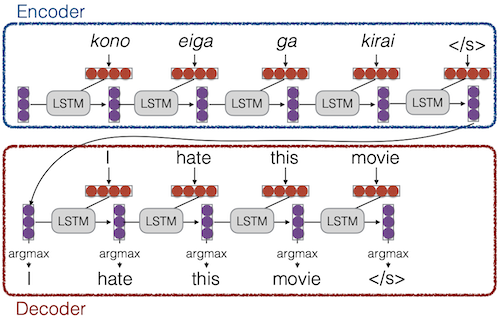
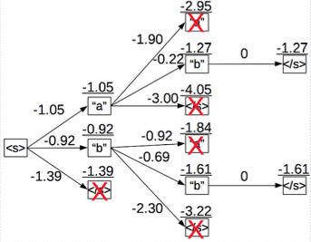
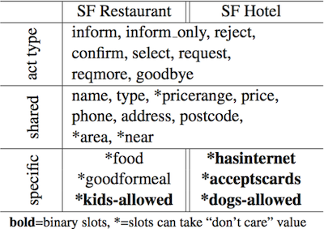
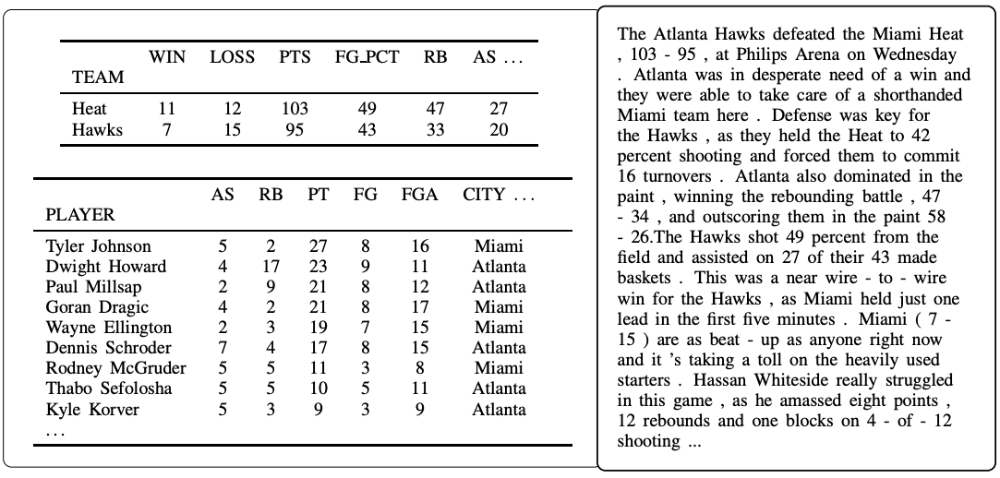
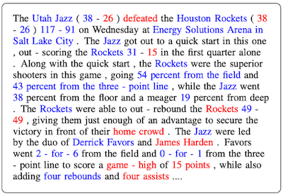
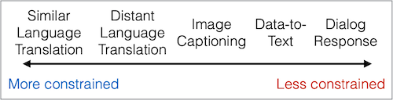
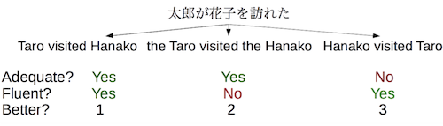
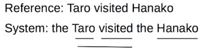
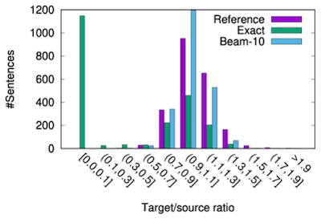
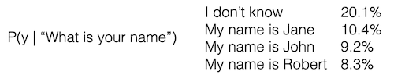

# 5 Conditioned Generation

> [CMU Advanced NLP 2022 (5): Conditioned Generation](https://youtu.be/FazNgBWvkkk)

Language model은 'generative models of text'로 정의할 수 있다.

$$ s \sim P(x) $$

이때 text를 생성하기 위해서는, specification이 필요하다. 다음은 conditioned language models의 대표적인 예시다.

| 입력 $X$ | 출력 $Y$ (**Text**) | Task |
| --- | --- | --- |
| structured data | NL description | NL generation |
| English | French | translation |
| document | short description | summarization |
| utterance | response | response generation |
| image | caption | image captioning |
| speech | transcript | speech recognition |

---

## 5.1 Formulation and Modeling

modeling을 위한 수식은 간단히 정의할 수 있다.

- Probability of a Sentence

```math
P(X) = \prod_{i=1}^I P(\underset{next \ word}{x_i} | \underset{Context}{x_1, \cdots , x_{i-1}})
```

Conditional Language Models은 다음과 같이 정의된다.

- **Conditional Language Models**

  - $X$ : **added context**

```math
P(Y|X) = \prod_{j=1}^{J} P(y_j | X, y_1 , \cdots, y_{j-1})
```

---

### 5.1.1 Early Conditional Language Model: Sequence to Sequence

> [Sequence to Sequence Learning with Neural Networks 논문(2014)](https://arxiv.org/abs/1409.3215)

context를 encoding하고 출력을 생성하기 위해서, 주로 encoder와 decoder가 합쳐진 neural network를 사용한다.



---

## 5.2 Methods of Generation

$P(Y|X)$ 모델을 획득했다면 출력을 생성해야 한다. 다음은 generation을 위한 두 가지 대표적인 방법이다.

| sampling | argmax |
| :---: | :---: |
| 확률 분포를 기반으로 임의로 생성 | 가장 높은 score를 바탕으로 생성 |
| Ancestral Sampling | Greedy Search, Beam Search |

---

### 5.2.1 Ancestral Sampling

**Ancestral Sampling**은, 단어를 one-by-one으로 임의로 생성하는 방법이다.

> (<\/s> : end of sentence)

- while $y_{j-1}$ != "<\/s>":

  $y_i \sim P(y_j | X, y_i, \cdots , y_{j-1})$

---

### 5.2.2 Greedy Search

**Greedy Search**는, one-by-one으로 가장 높은 확률을 갖는 단일 단어를 생성한다.

- while $y_{j-1}$ != "<\/s>":

  $y_i = \mathrm{arg}\max P(y_j | X, y_i, \cdots , y_{j-1}) $

하지만 greed search는 실전에서 다음과 같은 문제점을 보인다.

- (-) easy words를 먼저 생성하는 경향이 있다.

- (-) one rare word보다, multiple common words를 생성하는 경향이 있다.

---

### 5.2.3 Beam Search

greedy search의 단점을 보완하기 위해, **beam search**는 k개의 후보를 유지한 뒤 확률을 조사한다. 다음은 beam size $b = 2$ 로 설정한 beam search 예시이다. 

> beam size $b=1$ : greedy search와 동일하다.



- 세 가능성 중, 가장 낮은 가능성을 제거하고 두 후보를 유지한다.

- **beam size** $b$ 가 늘어나면, 탐색을 위해 더 많은 시간을 사용한다.

---

## 5.3 Case Study: Conditional Language Modeling

---

### 5.3.1 Translation

(생략)

---

### 5.3.2 Summarization

(생략)

---

### 5.3.3 Dialog Response Generation

(생략)

---

### 5.3.4 Image Captioning

(생략)

---

### 5.3.5 From Structured Data to Text

> [Semantically Conditioned LSTM-based Natural Language Generation for Spoken Dialogue Systems 논문(2015)](https://aclanthology.org/D15-1199/)

구조화된 데이터를 텍스트로 변환하는 task이다.



---

## 5.4 Difficulty of Generation

> [Challenges in data-to-document generation 논문(2017)](https://arxiv.org/abs/1707.08052)

표처럼 structured data를 이해하는 작업은 어려울 수 있다. 다음은 data-to-document generation에서 발생할 수 있는 어려움을 나타내는 예시다. 

- data

  

- generated text

  다음은 표의 데이터를 기반으로 생성된 텍스트이다.

  - 빨간색: erroneous text

  

---

### 5.4.1 Level of Constraint on Output

다음은 task에 따른 일반적인 난이도를 비교한 그림이다. 자유도가 높을수록(=flexibility가 높을수록), 대체로 modeling 및 evaluation의 난이도가 늘어난다.

> Distant Language: 일본어-영어 등



---

### 5.4.2 Controlled Generation

> [Controlling Politeness in Neural Machine Translation via Side Constraints 논문(2016)](https://aclanthology.org/N16-1005/)

따라서 content에 기반해 자유도를 제안하는 기법들이 사용되고 있다. 다음은 일부 예시이다.

- **politeness**/**style** control

  입력 $X$ 와 label indicating style을 함께 전달한다. (e.g. polite, informal)

  

- **personalization**

  입력 $X$ 와 speaker의 side information을 함께 전달한다. (e.g. 화자 스타일에 적합한 문장을 생성할 수 있도록)

---

## 5.5 Evaluation Paradigm

text generation 모델의 evaluation은, 다른 task보다 어려운 편이다.

---

### 5.5.1 Human Evaluation

> [Conference on Machine Translation (WMT) shared tasks](http://www.statmt.org/wmt20/)

> [GENIE leaderboard for QA, summarization, MT](https://genie.apps.allenai.org/)

사람의 평가 수준이 evaluation에서 궁극적인 목표에 해당되나, 느리고 비용이 많이 들며, 일관성이 없을 수 있다.



---

### 5.5.2 BLEU(Bilingual Evaluation Understudy) Score

**BLEU**는 reference를 기반으로, n-gram overlap을 비교하여 점수를 매기는 방법이다.



- BLEU-2 = $(3/5 * 1/4)^{1 \over 2} * 1.0 = 0.387$

  - 1-gram = 3/5

  - 2-gram = 1/4

  - brevity penalty = 1.0

    > brevity = $\min(1, \mathrm{|System|/|Reference|})$ = $\min(1, 5/3)$

하지만 사람의 평가와 일치하지 않는 경우가 많으며, 특히 system의 차이가 클 경우 적합하지 않다.

---

### 5.5.3 Embedding-based Metrics

따라서 최근에는 sequence를 encoding한 뒤, 출력과의 similarity를 비교하는 방법이 사용되고 있다.

- BertScore: BERT embeddings과 similarity를 계산한다. (unsupervised)

- BLEURT: BERT가 human evaluation scores를 예측하도록 학습한다.

- COMET: 마찬가지로 human eval을 예측하도록 모델을 학습하나, source sentence도 함께 사용하여 학습한다. 

  > human eval이 불완전할 수 있기 때문에, source를 함께 학습하여 보완한다.

- PRISM: 시스템 출력이 의역에 해당되는지 여부를 알기 위해, paraphrasing model을 학습한다.

- BARTScore: 시스템 출력의 확률을 계산한다.

---

### 5.5.4 Perplexity

(생략)

---

### 5.5.5 Which One to Use?

어떠한 metric을 사용할지는, **meta-evaluation** 과정을 통해 결정할 수 있다. meta-evaluation이란, human evaluation과 automatic evaluation 사이의, correlation을 측정하는 과정이다.

---

## 5.6 Revisiting Search

> [On NMT Search Errors and Model Errors: Cat Got Your Tongue? 논문(2019)](https://aclanthology.org/D19-1331/)

> [The Curious Case of Neural Text Degeneration 논문(2019)](https://arxiv.org/abs/1904.09751)

최적의 성능을 위해서는, 시스템에서 generation에서 사용하는 탐색 알고리즘을 주의해야 한다. 다음은 탐색 알고리즘에 의해 발생하는 대표적인 문제를 나타낸 예시다.

- bad model + big beam

  (모델링 오류가 많은) 성능이 나쁜 모델에서 big beam search를 적용할 때, 더 나은 scoring hypothesis는 worse generation을 유발할 수 있다.

  

  > 초록색을 최대한 따라갔을 때, 성능이 좋은 시스템에 해당된다.

- argmax 기반의 beam search는, repetition을 유발할 수 있다.

  

이처럼 좋은 성능으로 알려진 탐색 알고리즘이, 오히려 모델의 성능을 저하시킬 수 있다.

---

### 5.6.1 Alternative 1: Worse Search for Better Outputs

먼저 대안으로 lower-scoring hypothesis를 선택하는 방법이 제안되었다.

- $P(x_6|$ "The capital of Pennsylvania is" $)$

- 다음에 오는 단어의 후보는 다음과 같다.

  | word | prob |
  | :---: | :---: |
  | Harrisburg | 34.3% |
  | Philadelphia | 31.1% |
  | Pittsburgh | 12.9% |
  | Easton | 2.2% |
  | Lancaster | 1.8% |
  | Allentown | 1.6% |
  | Washington | 1.5% |

이대 lower-scoring의 구현에서는, 대표적으로 두 가지 알고리즘이 쓰인다. (특히 **Nucleus Sampling**이 보편적으로 쓰인다.)

| Top-k Sampling | Nucleus Sampling |
| :---: | :---: |
| e.g. k = 5(~Lancaster) | e.g. p = 0.8(Pittsburgh) |

---

### 5.6.2 Alternative 2: Better Decision Rule

> [Quality-Aware Decoding for Neural Machine Translation 논문(2022)](https://aclanthology.org/2022.naacl-main.100/)

또 다른 대안으로 Bayes risk를 최소화하는 방법이 제안되었다.

- **Bayes risk**

```math
\mathrm{BayesRisk}(y|x) = \sum_{\tilde{y}}P(\tilde{y}|x)\mathrm{Error}(y, \tilde{y})
```

따라서 목표는 다음과 같다.

```math
\hat{y} = \underset{y}{\mathrm{argmin}} \ \mathrm{BayesRisk(y|x)}
```

다음 예시를 보자.



1. beam search, sampling 등의 기법을 통해 n-best list를 획득한다.

2. Bayes risk를 최소화하여, n-best list를 rescoring한다.

---

### 5.6.3 Alternative 3: Train Better Model

혹은 bad hypotheses를 고평가하지 않는, 좋은 모델을 학습하는 방법을 고려할 수 있다. 다음은 해당 목표를 달성하기 위해 제안된 대표적인 방법이다.

- Minimum Risk Training

  > 주로 강화 학습, enumeration을 사용한다.

- Margin-based Training

  > 주로 ranking, contrastive learning을 사용한다.

---
