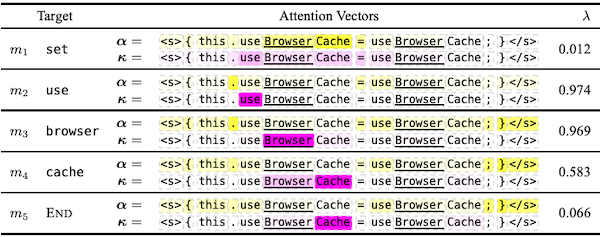
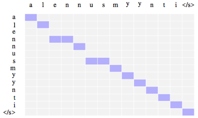

# 6 Attention

> [CMU Advanced NLP 2022 (6): Attention](https://youtu.be/0PPzD4mxpuM)

문장이 갖는 모든 의미를, 하나의 단일 벡터에 담을 수 없다. 

- 따라서 문장의 length에 맞게, 여러 벡터에 나눠서 정보를 나눠담는(encoding) 방법이 필요하게 되었고, 여기서 **attention**이 등장한다.

- decoding 과정에서는, 해당 벡터들을 linear combination한다. 

---

## 6.1 Calculating Attention

다음은 일본어가 입력, 영어가 출력인 translation task를 수행하는 (RNN style) 모델 예시다.

| 입력(일본어) | 출력(영어) |
| :---: | :---: |
|  |  |
| Key Vectors<br/>(all encoder states) | Query Vector<br/>(decoder state) |

현재 모델이 I, hate 두 단어를 번역했다고 가정하자. 

- 다음 단어를 번역하기 위해서, 마지막 벡터인 hate가 **query vector**로 사용된다.

- query를 바탕으로, 여러 입력(**key vectors**) 중, 어떤 입력에 attention해야 하는지 계산한다.

  > 이때 softmax를 사용하여, 0~1 사이로 normalize한다.


이후 attention weight와 key vectors를 곱한 뒤 결합하여, 다음 단어를 예측한다.


---

### 6.1.1 Attention Score Functions

모델에서 query( $q$ )와 key( $k$ ) 계산은, 다양한 방식으로 구현할 수 있다.

- **Multi-layer Perceptron**

  제일 처음에 고안된 방법이며, large data에 대해서도 잘 작동한다.

$$ a(q, k) = w_2^{\mathrm{T}} \mathrm{tanh}(W_1[q;k]) $$

- **Bilinear**

  > 현재 가장 널리 사용되는 방법에 해당된다.

$$ a(q,k) = q^{\mathrm{T}}Wk $$

- **Dot Product**

  추가적인 parameter가 필요하지 않지만, vector size가 동일해야 한다.

$$ a(q, k) = q^{\mathrm{T}}k $$

- **Scaled Dot Product**

  차원 수가 커질수록, dot product의 scale도 커지게 된다. 따라서 vector size를 scaling하여, 학습을 안정화시킨다.

$$ a(q, k) = {{q^{\mathrm{T}}k} \over {\sqrt{|k|}}} $$

---

## 6.2 Self Attention

보다 context sensitive한 encoding을 위해, 문장의 각 element가 다른 element들과 어떤 관계를 갖는지 계산하는 **self attention**이 등장했다.


---

## 6.3 Multi-headed Attention

> [A Convolutional Attention Network for Extreme Summarization of Source Code 논문(2016)](https://arxiv.org/abs/1602.03001)

> [Attention Is All You Need 논문(2017)](https://arxiv.org/abs/1706.03762)

오직 하나의 단어에 attention하지 않고, 문장의 다른 단어들에 대한 정보도 함께 고려할 수 있도록, **multi-headed attention**이 등장했다.

다음은 2 attention head를 사용하는 summarization task 예시다.



- head 1: 다음 단어를 생성하기 위해 representations에 attention한다.

- head 2: 입력을 copy한다.

  따라서, 개별 단어에 집중적으로 attention하고 있다.

이러한 밸런싱은 더 나은 성능으로 이어진다. 다음은 대표적인 예시에 해당되는, Transformer 논문에서 attention을 시각화한 결과다. 하나의 단어가 다양한 단어들에 대해 attention을 수행하고 있음을 알 수 있다.


---

## 6.4 Transformer

> [Attention Is All You Need 논문(2017)](https://arxiv.org/abs/1706.03762)

> [Harvardnlp: The Annotated Transformer](https://nlp.seas.harvard.edu/2018/04/03/attention.html)

Transformer는 sequencing coding을 위해 설계된 모델로, 하나의 입력 token은 하나의 vector로 변환된다.


- 세 가지 다른 연산으로 구성된다.

  multi-headed attention, residual connection & layer normalization, feed-forward network

- 오직 matrix multiplication으로 구성되어 빠르고, 병렬화가 가능하다.

---

### 6.4.1 Attention Tricks

Transformer 모델이 포함하는 attention의 변형을 살펴보자.

- self attention

- Multi-headed Attention

  8개 attention head가 독립적으로 학습된다.

- Notmalized Dot Product Attention

- Positional Encoding

---

### 6.4.2 Traning Tricks

- Layer Normalization

  매우 크거나 작은 embedding이 학습을 불안정하게 만드는 상황을 방지한다.

- Specialized Training Schedule

  Adam optimizer 기반으로, Transformer에 적합한 학습 스케줄을 사용한다.

- Label Smoothing

  uncertainty를 삽입하는 것으로 over-confidence를 방지한다.

- Masking for Efficient Training

---

### 6.4.3 Masking for Training

오로지 이전 단어에만 초점을 맞추도록, mask를 이용한 학습을 진행한다.

> 덕분에 순차적으로 학습하는 RNN과 달리, Transformer는 병렬적으로 학습이 가능하다.


---

## 6.5 Extensions to Attention

---

### 6.5.1 Incorporating Markov Properties

현재의 attention은, last time attention과 상관관계를 갖는 경향이 있다. 따라서, 다음 결정을 내릴 때, last attention의 정보를 사용하는 방법이 제안되었다.


---

### 6.5.2 Hard Attention

soft interpolation을 사용하는 attention과 달리, **hard attention**은 **zero-one decision**을 하도록 하나의 attention만을 선택한다.

- 오로지 일부에 초점을 맞추기 위해, 계산을 굉장히 줄일 수 있다.

- 학습이 어려우며, 강화 학습 같은 방법이 필요하다.

---

### 6.5.3 Monotonic Attention

speech recognition, incremental translation 등, 일부 task는 출력이 입력과 동일한 순서를 따르게 된다. 따라서, 순서에 맞게 attention을 제한하는 기법이 등장했다.



---

### 6.5.4 Coverage

모델이 content를 놓치거나 동일한 출력을 반복하는 문제를 해결하기 위해, 단어가 다루어진 횟수에 따라 패널티를 부여하는 방법이 제안되었다.

---

### 6.5.5 Bidirectional Training

attention은 forward, backward direction 모두 비슷한 경향을 보이므로, 양방향으로 학습하는 방법이 제안되었다.

```math
\mathrm{tr}(A_{X \rightarrow Y}, A_{X \rightarrow Y}^{\mathrm{T}})
```

---

### 6.5.6 Attention is not Alignment

다음은 attention의 alignment 관점에서 발생할 수 있는 문제를 나타낸 예시다.


- attention은 종종 blurred된다.

- attention은 종종 off by one하다.

  실제로 주의해야 하는 단어가 아닌, 앞이나 뒤에 위치한 단어에 주의하게 된다.

이러한 문제점을 해결하기 위해, alignment에 따라 패널티를 부여하는 supervised training 방법이 제안되었다.

> 수동으로 정렬하거나, strong alignment model과 함께 학습한다.

---