# 7 Pre-training Methods

> [CMU Advanced NLP 2022 (7): Pre-training Methods](https://youtu.be/27LkyrxaUK4)

먼저 몇 가지 용어에 대한 개념을 정리하고 넘어가자.

| 용어 | 설명 |
| --- | --- |
| Multi-task learning | 하나의 모델을 여러 task에 대해 학습 |
| Transfer learning | 하나의 task에 대해 학습된 모델을, multi-task에 대해 학습 |
| Pre-training | transfer learning의 한 종류로, 하나의 objective를 먼저 학습시킨 경우 |
| Few-shot, Zero-shot learning | 특정 task에 대해, 매우 적은 혹은 zero labels 예제를 기반으로 한 학습 |

---

## 7.1 Plethora of Tasks in NLP

NLP는 굉장히 다양한 task를 포함하고, 학습을 위해 매우 다양한 데이터가 필요하다. 다음은 필요한 데이터의 종류에 따른, 몇 가지 task의 예시이다.

| requried data | Only text | Naturally occurring data | Hand-labeled data |
| --- | :---: | :---: | :---: |
| example | language modeling | machine translation | most analysis tasks |

---

## 7.2 Multi-task Learning

다음은 multi-task learning의 세 가지 대표적인 방법이다.

| Methods |  |
| :---: | :---: |
| Standard | 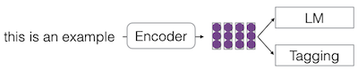 |
| | 한번에 multiple tasks에서 representation을 학습한다. (e.g., multiple tasks 내 하나의 task에서, minibatch를 임의로 선택) |
| Pre-train and Fine-tune | 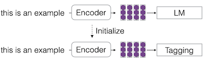 |
| | 하나의 task를 학습하고, 이후 다른 task를 학습한다. |
| Prompting | 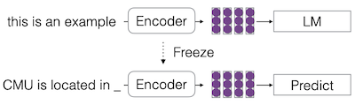 |
| | 하나의 task(e.g., LM)에 대해 학습한 뒤, textualized task에 대해 예측한다. |

---

## 7.3 Pre-trained LMs

언어 모델의 부상 이래로 BERT, RoBERTa, GPT-3, PaLM 등, 다양한 pre-trained LM이 등장했다. 

- 대부분 **Transformer** 기반 모델이다. (세부적으로는 variation이 다양하게 존재한다.)

  - 대체로 파라미터가 많을수록, 성능이 좋다.

- **training objective**는, 크게 두 가지 variation이 사용된다.

| Auto-regressive  | Masked language modeling |
| :---: | :---: |
| 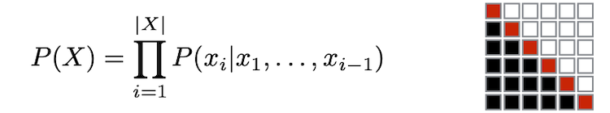 | 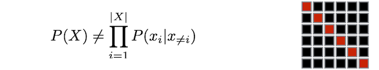 |
| 주로 prompting, text generation에서 사용된다. | 주로 pre-train + fine-tune에서 사용된다. |

- 데이터는 books corpus, Wikipedia, 웹 크롤링 데이터 등이 주로 쓰인다.

---

## 7.4 Representation Learning through LMs

pre-trained LM을 사용한 representation learning 예시를 살펴보자.

---

### 7.4.1 BERT

> [BERT: Pre-training of Deep Bidirectional Transformers for Language Understanding 논문(2018)](https://arxiv.org/abs/1810.04805)

다음은 Google에서 발표한 대표적인 pre-trained LM 모델인 BERT이다. BERT의 목표는 두 가지로, (마스킹된 단어만 예측하는) **Masked Language Modeling**(MLM)과, **Next Sentence Prediction**(NSP)로 구성된다.

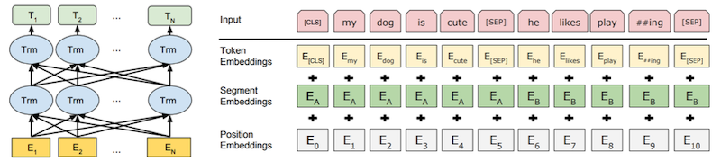

> [SEP]: separator token, [CLS]: classification token

- 구성 요소: multi-layer self-attention, input sentence or pair, w/ [CLS] token, sub-word tokenization

- BooksCorpus(800M words), Wikipedia(2,500M words) 데이터를 사용해 학습되었다.

---

#### 7.4.1.1 Masked Word Prediction

BERT는 최적의 masked word prediction을 위해, 다음과 같은 masking rate로 입력을 변화시킨다.

- RANDOM 토큰 

  MASK 토큰이 원래 vocabulary에 속하는 토큰이 아니므로, 모델이 특정한 무언가와 연관시키지 않도록(잊어버리도록) RANDOM 토큰을 추가한다.

| MASK | RANDOM | SAME |
| :---: | :---: | :---: |
| 80% | 10% | 10% |

---

#### 7.4.1.2 Consecutive Sentence Prediction

입력으로 두 개의 문장 A, B을 준 뒤, consecutive한 문장인지를 예측하는 것을 목표로 한다.

- 50%의 확률로, 두 문장은 corpus에서 consecutive한 문장이다.

- 나머지 50% 확률로, 서로 관련이 없는 문장이다.

| Consecutive (50%) | Not related (50%) |
| :---: | :---: |
| 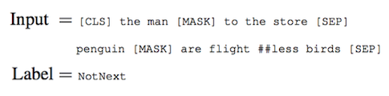 | 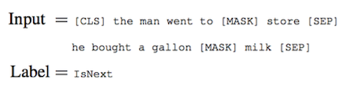 |

---

### 7.4.2 Hyperparameter Optimization/Data: RoBERTa

> [RoBERTa: A Robustly Optimized BERT Pretraining Approach 논문(2019)](https://arxiv.org/abs/1907.11692)

RoBERTa는 BERT의 facebook 버전으로 볼 수 있는 모델로, BERT와 동일한 모델을 사용하지만, 다음과 같은 차이로 더 좋은 성능을 획득했다.

- **Objective**

  - 큰 batch로, 오래 학습한다.

  - Next Sentence Prediction(NSP)을 고려하지 않는다.

- 데이터

  - 기존 데이터(BooksCorpus + English Wikipedia)
  
  - 일부 데이터(CC-News, OpenWebText, Stories)를 추가하여 학습한다.

- Dynamic masking

  - 서로 다른 위치에 마스킹한 데이터를 기반으로 학습한다. (이를 위해 학습 데이터가 10배 크기로 복사된다.)
   
    > 기존 BERT의 방식은 static masking으로 구분한다.

---

### 7.4.3 Distribution Discrimination: ELECTRA

> [ELECTRA: Pre-training Text Encoders as Discriminators Rather Than Generators 논문(2020)](https://arxiv.org/abs/2003.10555)

ELECTRA도 마찬가지로 BERT와 동일한 모델을 사용하지만, **Generator**, **Discriminator**를 기반으로 한 objective를 사용한다. 입력을 마스킹하는 기존의 방법 대신 generator가 fake token을 만들면, discriminator가 이를 식별하는 방식이다. (Replaced Token Detection)

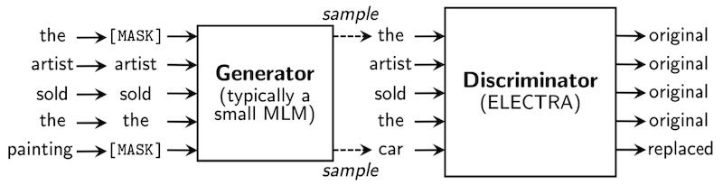

- Generator의 크기는, Discriminator보다 작은 1/4~1/2로 설정한다. ( $G < D$ )

  - 크기가 동일할 경우 weight sharing이 가능하나, 2배 더 많은 계산이 필요하게 된다.

  - weight sharing: embedding layer만 공유한다.

- 데이터

  - BERT와 동일 조건, 혹은 XL-Net와 동일 조건의 데이터를 사용했다.

이러한 방식의 학습으로, 기존보다 적은 학습 비용 및 시간으로도, BERT와 GPT보다도 더 좋은 성능의 모델을 획득하였다.

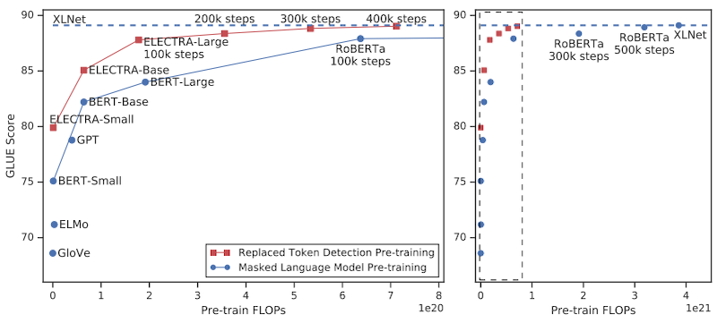

---

### 7.4.4 Permutation-based Auto-regressive Model: XLNet

> [XLNet: Generalized Autoregressive Pretraining for Language Understanding 논문(2019)](https://arxiv.org/abs/1906.08237)

XLNet은 BERT와 동일한 모델을 사용하나, **보다 긴 context**를 포함하여 학습한다.

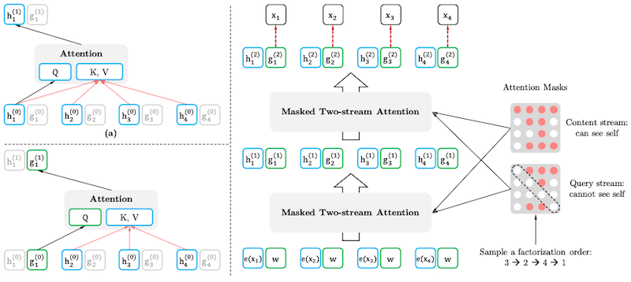

- permutation 기반으로 **단어의 순서를 모델링한다.**

  - (+) 양방향 context를 고려해 모델링할 수 있다.

  - 순서 집합( $Z$ ): 예를 들어, input sequence $[x_1, x_2, x_3, x_4]$ 의 순서는, $4!=24$ 개가 존재할 수 있다.

$$ \mathrm{likelihood}: \mathbb{E}_{z \sim Z_T} [\prod_{t=1}^{T}p(x_{z_t}|x_{z<t})] $$

- 데이터

  - Books, Wikipedia, 웹 데이터 등을 사용한다.(39B tokens)

---

### 7.4.5 Disentangled Attention: DeBERTa

> [DeBERTa: Decoding-enhanced BERT with Disentangled Attention 논문(2020)](https://arxiv.org/abs/2006.03654)

DeBERTa는 Disentangled Attention과, absolute position embedding을 고려하는 Enhanced Mask Decoder를 제안하여, 당시 SuperGLUE에서 SOTA 성능을 달성했다.

- Disentangled Attention

  relative position과 content를 분리하여, attention을 계산한다.

- Enhanced Mask Decoder

  입력부에서 position embedding이 더해지는 BERT와 달리, 출력부에서 position embedding이 더해진다.

- 데이터

  Wikipedia, Reddit, Common Crawl의 subset 데이터를 사용한다.

---

### 7.4.6 Compact Pre-trained Models

(생략)

- ALBERT

- DistilBERT

---