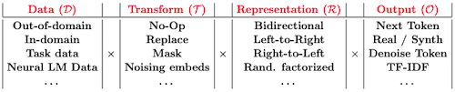
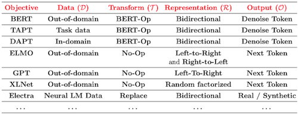
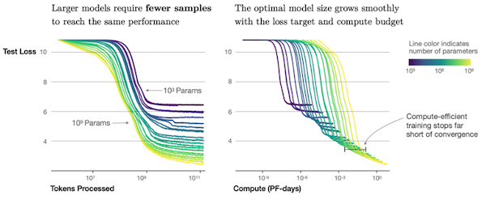

# 7 Pre-training Methods

> [CMU Advanced NLP 2022 (7): Pre-training Methods](https://youtu.be/27LkyrxaUK4)

---

## 7.5 Auto-regressive LMs for Generation/Prompting

---

### 7.5.1 GPT-2

> [OpenAI: Better language models and their implications(2019)](https://openai.com/research/better-language-models)

GPT-2는 long-form text의 생성 및 zero-shot task completion에서, SOTA를 달성한 모델이다.

- model: left-to-right transformer (1.5B)

- objective: standard language modeling

- 데이터

  다양한 도메인을 포함하도록, 수만 개의 웹페이지에서 획득한 WebText로 학습했다. 
  
  > down-stream task에서 fine-tuning이 용이하기 위한 목적

---

### 7.5.2 GPT-3

> [Language Models are Few-Shot Learners 논문(2020)](https://arxiv.org/abs/2005.14165)

- model: left-to-right transformer (175B)

- objective: standard language modeling

- 데이터

  CommonCrawl (1T words)

---

### 7.5.3 PaLM

> [PaLM: Scaling Language Modeling with Pathways 논문(2022)](https://arxiv.org/abs/2204.02311)

PaLM은 구글에서 발표한 모델로, 효율적인 학습이 가능한 Pathways 시스템을 통해 GPT-3보다 큰 모델을 학습했다.

- model: left-to-right transformer (540B)

- objective: standard language modeling

- 데이터

  CommonCrawl (1T words)

---

### 7.5.4 OPT/BLOOM

> [OPT: Open Pre-trained Transformer Language Models 논문(2022)](https://arxiv.org/abs/2205.01068)

> [BLOOM: A 176B-Parameter Open-Access Multilingual Language Model 논문(2022)](https://arxiv.org/abs/2211.05100)

다음은 대표적인 오픈소스 LLM 모델이다.

(생략)

---

## 7.6 Should we be Pre-training?

다음은 pre-training 후 fine-tuning의 장단점을 비교한 표이다.

| Pros | Cons |
| --- | --- |
| 한 모델을 잘 학습해서, 다양한 downstream task에서 사용한다. | pre-training 성능이 downstream 성능을 보장하지 않는다. |
| 학습에 필요한 연산 비용을 분할할 수 있다.(amortize) | 하나의 pre-training objective로는, 모든 end tasks에서 작동하지 않는다. |
| transfer learning 단계에서 여러 장점을 가진다. | pre-training 단계에서, downstream task에 대한 명확한 cross-validate 방법이 존재하지 않는다. |

pre-training은, transfer learning 단계에서 다음과 같은 장점을 가진다.

- downstream performance가 향상된다.

- 적은 epoch, datapoint로 좋은 성능을 달성할 수 있다. (faster convergence, data-efficiency)

---

### 7.6.1 Pre-training Design Choices

pre-training objective는 다음과 같이 다양한 design choices를 가질 수 있다. 

| | |
| :---: | :---: |
| design |  |
| Models |  |

---

## 7.7 Practicals of Using Large Pre-trained Models

다음은 pre-trained model을 사용할 때, 몇 가지 고려할 팁이다.

- 가용 자원을 고려하여, 경우에 따라서는 DistilBERT처럼 작은 모델을 사용한다.

- large batch size는 OOM을 유발할 수 있으므로, 적절한 batch size로 실험을 진행할 필요가 있다.

- 일부 레이어를 대상으로 먼저 fine-tuning을 진행한다. (selective fine-tuning)

  > top few layers $\rightarrow$ layer-norm layers $\rightarrow$ else

---

## 7.8 Scaling Laws

> [Scaling Laws for Neural Language Models 논문(2020)](https://arxiv.org/abs/2001.08361)

(생략)

---