# 8 Multi-task, Multi-domain, and Multi-lingual Learning

> [CMU Advanced NLP 2022 (8): Multi-task, Multi-domain, and Multi-lingual Learning](https://youtu.be/BXPyIENMs4Y)

Multi-task Learning이란, 한번에 multiple task에 대한 representation을 학습하는 것을 의미한다.

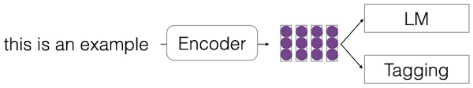

---

## 8.1 Applications of Multi-task Learning

다음은 multi-task learning의 세 가지 대표적인 예시다. 

> 두 task 중 하나의 task에서 학습에 쓸 data가 적을 때, 주로 사용된다.

| task | | fewer data task | e.g. |
| :---: | :---:| :---: | :---: |
| plain text | $\rightarrow$ | labeled text | LM $\rightarrow$ parser |
| general domain | $\rightarrow$ | specific domain | web text $\rightarrow$ medical text |
| high-resourced language | $\rightarrow$ | low-resourced language | English $\rightarrow$ Telugu |

---

## 8.2 Domain Adaptation

---

### 8.2.1 Domain

domain이란, 다음과 같이 입출력의 서로 다른 joint distribution을 갖는 것으로 정의할 수 있다.

$$ P_{d1}(X,Y) \neq P_{d2}(X,Y) $$

또한 하나의 task에서도, 입력 데이터의 종류에 따라서 매우 다양한 분포를 가질 수 있다. 

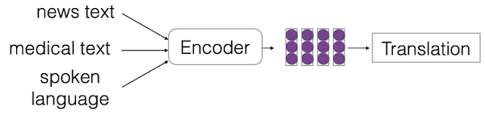

- 이때 domains은 label이 있는 경우와, 없는 경우로 나뉜다.

- content, style, labeling standards 등이 다양한 domain을 구분하는 기준이 될 수 있다.

---

### 8.2.2 Types of Domain Shift

- **covariate shift**

  입력은 변하지만, label은 변하지 않는 경우이다.

$$ P_{d1}(X) \neq P_{d2}(X) \quad \quad P_{d1}(Y|X) = P_{d2}(Y|X) $$

- **concept shift**

  label의 conditional distribution이 변하는 경우이다.

$$ P_{d1}(Y|X) \neq P_{d2}(Y|X) $$

---

### 8.2.3 Domain Adaptation

학습은 many domains 혹은 high-resourced domain에서 진행한 뒤, 테스트는 low-resourced domain에서 수행한다

> **supervised**, **unsupervised** adaptation으로 나뉜다.

| | |
| :---: | :---: |
| Train | 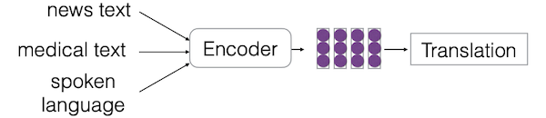 |
| Test |  |

이때, 많은 domain에서 학습하고, 모든 도메인에서 잘 작동하는 것을 목표로 한다. 다시 말해, minority domains에 robust해야 한다. 

> 가령 기계 변역의 경우, 모든 언어에 대해 잘 작동해야 한다.

---

## 8.3 Multilingual Learning

많은 언어가 동일한 어원을 공유하며, 구조나 문법이 유사한 경우가 많다. 또한, 영어와 중국어처럼 차이가 많아 보이는 언어도, 구조적으로는 유사성을 갖는다.

| similar word roots | similar word order, grammer |
| :---: | :---: |
| 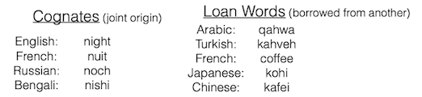 | 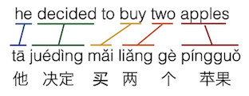 |

서로 다른 언어는 각 domain에 해당되며, 다음과 같이 multi-task learning을 수행한다.

- **adapatation**

  high-resourced language에서 학습하여, low-resourced language의 정확도를 향상시킨다.

- **robustness**

  하나의 모델이 모든 언어에 대해 잘 작동하도록 구성한다.

  > lexicon에서의 유사성/차이, morphology, syntax, semantics, culture 등 복잡한 여러 요소를 고려해야 한다.

---

## 8.4 Parameter Sharing Methods

multi-task learning을 효과적으로 할 때, 우선적으로 고려해야 할 부분은 parameter sharing이다. 

| | all params | some model components | very few params |
| :---: | :---: | :---: | :---: |
| e.g. | 모든 도메인이 단일 모델의 가중치를 공유 | encoder는 공유, decoder는 분리 | 도메인마다 single embedding을 사용 | 

하지만 도메인 차이를 무시하고, 모든 도메인에서 단일 모델의 가중치를 공유하는 방법은, concept shift로 인해 최적 성능을 획득하기 힘들다.

---

### 8.4.1 Single Parameter Decoupling: Domain Tag

> [Unsupervised Cross-lingual Representation Learning at Scale 논문(2019)](https://arxiv.org/abs/1911.02116)

이러한 문제를 해결하기 위한 가장 간단한 접근으로, 입력에 domain tag를 추가하는 방법을 고려할 수 있다.

- (+) 도메인마다 작은 파라미터 증가(embedding size)로, 효과적으로 성능을 향상시킨다.

| | |
| :---: | :---: |
| 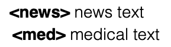 | 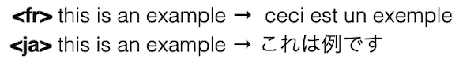 |

하지만 이처럼 최소한의 파라미터만 decoupling하는 경우, 다음과 같은 문제가 발생한다.

- (-) 모델 크기가 고정되었을 경우, 언어 수를 늘릴수록 각 언어의 capacity가 줄어든다.

  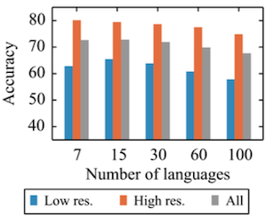

---

### 8.4.2 Aggressive Parameter Decoupling

따라서, 앞선 문제를 해결하기 위해, encoder와 decoder를 언어마다 분리하는 방안이 제시되었다.

- (-) 다른 언어와 도메인이 가진 유사한 성질을 공유할 수 없다.

- (-) 파라미터가 굉장히 많이 필요하게 된다.

하지만 현재 LLM이 발전하면서, 이러한 방법은 더 이상 사용되지 않는다.

---

### 8.4.3 Minimal Parameter Decoupling: Adapters

> [Parameter-Efficient Transfer Learning for NLP 논문(2019)](https://arxiv.org/abs/1902.00751)

> [Towards a Unified View of Parameter-Efficient Transfer Learning 논문(2021)](https://arxiv.org/abs/2110.04366)

fine-tuning 과정에서, task마다 학습 가능한 소량의 파라미터(전체의 3~4%)를 포함하는, Adapter 모듈 기반의 학습 방법이 제안되었다.

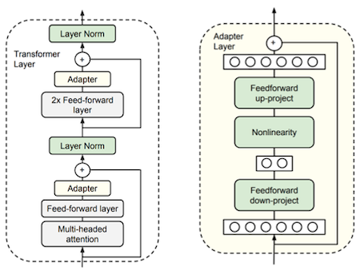

- Feed-forward layer 뒤에, 해당 모듈이 추가된다.

---

### 8.4.4 Regulatization Methods for Adaptation

> [Regularization techniques for fine-tuning in neural machine translation 논문(2017)](https://arxiv.org/abs/1707.09920)

특정 도메인 데이터에 대한 overfitting은, domain adaptation을 위한 transfer learning에 악영향을 준다. 따라서, 이를 방지하기 위한 몇 가지 regularization 방법을 고려할 수 있다.

- **Early stopping**

  overfit이 시작되는 지점에서 학습을 중단한다.

- **Explicit regularization**

  initial parameter와의 거리를 최소화하면서 학습한다.(e.g. L2 regularization)

$$ {\theta}_{adapt} = {\theta}_{pre} + {\theta}_{diff} $$

- **Dropout**

---

### 8.4.5 Soft Parameter Tying

> [Low Resource Dependency Parsing: Cross-lingual Parameter Sharing in a Neural Network Parser 논문(2015)](https://aclanthology.org/P15-2139/)

반면, task마다 파라미터를 느슨하게 공유하는 방법도 활용할 수 있다.

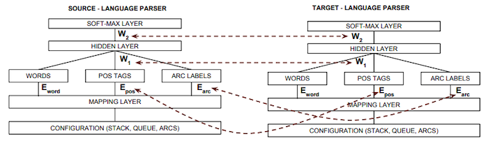

- 파라미터가 서로 가까워지도록 regularize되지만, hard fashion으로 묶이지는 않는다.

---

### 8.4.6 Selective Parameter Adaptation

> [Transfer Learning for Low-Resource Neural Machine Translation 논문(2016)](https://aclanthology.org/D16-1163/)

다음은 기계 변역을 위한 cross-lingual transfer learning에서, 최적의 파라미터 공유 설정을 찾기 위한 실험 결과이다.

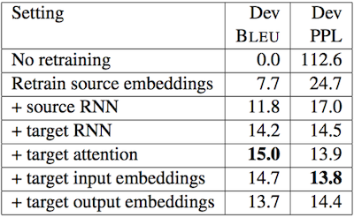

(생략)

---

### 8.4.7 Feature Space Regularization

> [Domain-Adversarial Training of Neural Networks 논문(2015)](https://arxiv.org/abs/1505.07818)

DANN은 feature extractor 이후, label predictor와 domain classifier를 두는 구현을 통해, 두 domain의 거리가 가까워지도록 학습한다.

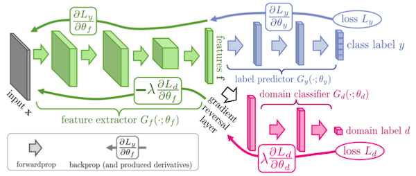

---

## 8.5 Task Weighting

서로 다른 task를 학습할 때는, 각 task를 어느 정도의 비중으로 학습할지 정해야 한다.

| Task Weighting | Task Sampling |
| :---: | :---: |
| loss function의 weight를 다르게 둔다. | sampling propotion을 다르게 둔다. |

또한, task의 학습 순서도 고려해야 한다. (**curriculum learning**)

---

### 8.5.1 Simple Task Weighting

> [Multi-Task Learning Using Uncertainty to Weigh Losses for Scene Geometry and Semantics 논문(2017)](https://arxiv.org/abs/1705.07115)

먼저 대표적인 task weighting 기법을 살펴보자.

| Uniform | Proportional | Temperature-based | uncertainty-based |
| :---: | :---: | :---: | :---: |
| 모든 task를 동일하게 sample/weight한다. | data size에 따라 sample/weight한다. | data size 기반 temperature로,<br>sampling 확률을 설정한다.( $1 \over {\tau}$ ) | 학습 가능한 uncertainty를 두어<br>loss를 scaling한다. |

- temperature-based

  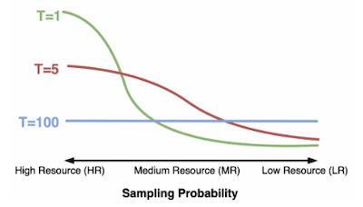

- uncertainty-based

$$ \mathcal{L}_{total} = \sum_{u} {{\mathcal{L}} \over {2{\sigma}_i}} + \log {{\sigma}_i} $$

---

### 8.5.2 Choosing Transfer Tasks

> [Choosing Transfer Languages for Cross-Lingual Learning 논문(2019)](https://aclanthology.org/P19-1301/)

유사한 task(언어) 사이의 transfer learning은, 다른 경우보다 성능 이점을 얻기 쉽다. 따라서, 이러한 유사성에 기반해 transfer task를 선택하는 방법이 제안되었다.

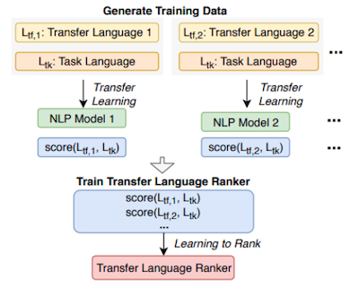

(생략)

---

### 8.5.3 Distributionally Robust Optimization

여러 도메인에서 잘 작동하는 모델을 확인하기 위해, 다음과 같은 worst case의 loss를 최적화하는 방법이 제시되었다.

```math
\mathcal{L} = \underset{\theta}{\arg \min} \ \underset{\tilde{\mathcal{L}}}{\max} \tilde{\mathcal{L}}(\theta) 
```

---