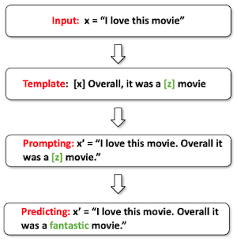

# 9 Prompting

> [CMU Advanced NLP 2022 (9): Prompting](https://youtu.be/5ef83Wljm-M)

> [Pre-train, Prompt, and Predict: A Systematic Survey of Prompting Methods in Natural Language Processing 논문(2021)](https://arxiv.org/abs/2107.13586)

---

## 9.1 Four Paradigms of NLP Progress

다음은 NLP 연구의 대표적인 네 가지 패러다임을 정리한 표이다.

|| Feature Engineering | Architecture Engineering | Objective Engineering | Prompt Engineering |
| --- | --- | --- | --- | --- |
| Paradigm | fully supervised (Non-neural network) | fully supervised (neural network) | pre-train, fine-tune | pre-train, prompt, predict |
| Time Period | popular ~2015 | 2013-2018 | 2017-Now | 2019-Now |
| characteristic | 수동 feature extraction 필요 | 신경망 설계 필요(e.g. LSTM, CNN) | 초기화를 위해 Pre-trained LMs 사용 objective function을 설계 | prompts engineering 필요 |
| works | SVM(Support Vector Machine) CRF(Conditional Random Fields) | CNN for text classification | BERT $\rightarrow$ fine-tuning | GPT-3 |

---

## 9.2 Prompting

**prompting**이란, 해야 할 task를 명시한 'prompt'를 제공하는 것으로, 특정한 예측을 하도록 pre-trained model을 조작하는 방법을 의미한다.

이러한 prompting의 workflow는, 크게 prompt addition, answer prediction, mapping 세 가지 단계로 진행된다.

| workflow | description | |
| --- | --- | :---: |
| **Prompt Addition** | 1. input [x] 와 answer [z] slot를 포함하는 template를 정의한다. 2. input slot [x]를 채워넣는다.  |  (sentiment classification) |
| | $\downarrow$ | |
| **Answer Prediction** | prompt를 바탕으로 answer [z]를 예측한다.  |  |
| | $\downarrow$ | |
| **Mapping** | answer를 바탕으로 class label을 mapping한다. |  |

---

### 9.2.1 Types of Prompts

다음은 다양한 prompt의 유형에 따른 예시를 나타낸 도표다.

| type | description| example |
| --- | --- | --- |
| prompt | | "I love this movie. Overall it was a **[z]** movie" |
| Filled prompt | any answer를 채워둔 prompt | "I love this movie. Overall it was a **boring** movie" |
| Answered prompt | true answer를 채워둔 prompt | "I love this movie. Overall it was a **fantastic** movie" |
| Prefix prompt | prefix 뒤에 이어질 내용을 채우도록 요구한다. | "I love this movie. Overall this movie is **[z]**" |
| Cloze prompt | [z] 양 옆으로 단어가 존재한다. | "I love this movie. Overall it was a **[z]** movie" |

> prefix prompt는 [z]가 마지막에 위치해야 하는 제약이 존재하나, 덕분에 left-to-right 예측에 적합하다는 장점을 갖는다.

---

## 9.3 Design Considerations for Prompting

prompting을 설계할 때, 다음과 같은 사항을 고려해야 한다.

- Pre-trained LM

- Prompt Engineering

- Answer Engineering

- Expanding the Paradigm

- Prompt-based Training Strategies

---

## 9.4 Pre-trained LM

크게 네 가지 framework로 나눌 수 있다.

| framework | description | example | |
| --- | --- | --- | --- |
| Left-to-Right LM | 특히 대규모 LMs에 적합하다. 주로 prefix prompts를 사용한다. | GPT-1, GPT-2, GPT-3 |  |
| Masked LM | NLU task에 적합하다. 주로 cloze prompt를 사용한다. | BERT, ERNIE |  |
| Prefix LM | Masked & Left-to-Right의 결합이다. 서로 다른 두 종류의 mask를 처리할 수 있다. | UniLM 1,2 ERNIE-M |  |
| Encoder-Decoder | 서로 다른 Transformer 모델, mask mechanism을 사용한다. denoised auto-encoder를 기반으로 학습한다. | BART, T5 |  |

> NLU(Natural Language Understanding) task는 cloze task로 구조를 재구성할 수 있다.

> Prefix LM/Encoder-Decoders 응용 예: conditional text generation(translation, summarization), generation-kike tasks(information extraction, question answering)

---

### 9.4.1 Encoder-decoder Pre-training

> [MASS: Masked Sequence to Sequence Pre-training for Language Generation 논문(2019)](https://arxiv.org/abs/1905.02450)

> [BART: Denoising Sequence-to-Sequence Pre-training for Natural Language Generation, Translation, and Comprehension 논문(2019)](https://arxiv.org/abs/1910.13461)

> [Multilingual Denoising Pre-training for Neural Machine Translation 논문(2020)](https://arxiv.org/abs/2001.08210)

> [Unified Language Model Pre-training for Natural Language Understanding and Generation 논문(2019)](https://arxiv.org/abs/1905.03197)

> [Exploring the Limits of Transfer Learning with a Unified Text-to-Text Transformer 논문(2019)](https://arxiv.org/abs/1910.10683)

대표적인 Encoder-decoder 모델의 학습법을 살펴보자.

- **MASS**

    | | description |
    | :---: | :---: |
    | method |  |
    | Model | Transformer-based Encoder-decoder |
    | Objective | 오직 mask된 범위의 예측 |
    | Data | WebText | 

- **BART**

    | |  description |
    | :---: | :---: |
    | method |  |
    | Model | Transformer-based Encoder-decoder |
    | Objective | corrupted sentence의 재구성  |
    | Data | BookCorpus, BookCorpus, CC-News, WebText, Stories | 

- **mBART**

    | | description |
    | :---: | :---: |
    | method |  |
    | Model | Transformer-based Multi-lingual Denoising auto-encoder |
    | Objective | corrupted sentence의 재구성 |
    | Data | CC25 Corpus (25개 언어) | 

- **UNiLM**

    | | description |
    | :---: | :---: | 
    | method |  |
    | Model | prefixed-LM, left-to-right LM, Masked LM |
    | Objective | 세 종류의 LM이 파라미터를 공유한다. |
    | Data | English Wikipedia, BookCorpus | 

- **T5**

    | | description |
    | :---: | :---: |
    | method |  |
    | Model | encoder-decoder, left-to-right LM, Prefixed LM |
    | Objective | 서로 다른 objective를 갖는다. |
    | Data | C4(750G), Wikipedia, RealNews, WebText | 

---

## 9.5 Prompt Engineering

그렇다면 어떻게 template를 설계해야 할까? 다음은 prompt engineering의 몇 가지 대표적인 갈래를 나타낸 그래프다.

> Automated search: 탐색 공간의 성격에 따라, discrete space, continuous space로 나뉜다.

---

### 9.5.1 Automated Prompt Search

> [How Can We Know What Language Models Know? 논문(2019)](https://arxiv.org/abs/1911.12543)

> [AUTOPROMPT: Eliciting Knowledge from Language Models with Automatically Generated Prompts 논문(2020)](https://arxiv.org/abs/2010.15980)

> [The Power of Scale for Parameter-Efficient Prompt Tuning 논문(2021)](https://arxiv.org/abs/2104.08691)

다음은 자동으로 최적의 prompt를 설계하는 알고리즘의 대표적인 예시다.

- **Prompt Mining**

  (questions/answers) 집합을 주면, 적절한 패턴의 prompt를 찾는다.

  

- **Prompt Parapharasing**

  기존에 존재하는 prompt를 기반으로 다른 candidate를 paraphrase한다.

  

- **Gradient-based Search**

  

- **Prefix/Prompt Tuning**

  words 대신, prompt의 embedding을 최적화한다.

  - Prompt Tuning: embedding layer만 최적화

  - Prefix Tuning: 모든 레이어의 prefix만 최적화

  

---